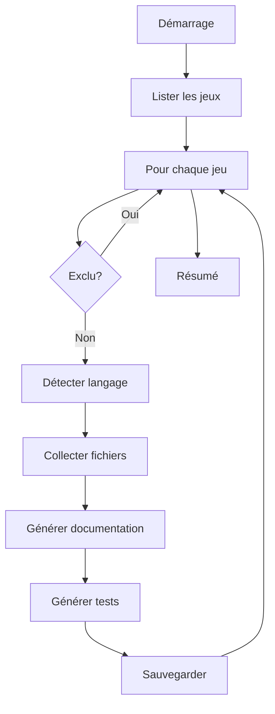

# Générateur de documentation et tests

Le générateur automatique utilise l'IA Ollama pour créer la documentation technique et les tests unitaires des jeux.

## 📋 Présentation

**Fichier** : `generate_docs_and_tests.py`

Le générateur parcourt automatiquement tous les jeux de la borne, analyse leur code source et génère :

- 📝 **Documentation technique complète** en Markdown
- 🧪 **Tests unitaires** adaptés au langage (JUnit, pytest, busted)

## 🎯 Fonctionnalités

### Détection automatique

- ✅ Détecte le langage principal de chaque jeu
- ✅ Collecte les fichiers sources pertinents
- ✅ Ignore les ressources (images, sons, etc.)
- ✅ Exclut automatiquement certains jeux (Galad-Scott)

### Génération intelligente

- ✅ Prompts contextualisés pour l'IA
- ✅ Documentation structurée et complète
- ✅ Tests adaptés au framework utilisé
- ✅ Gestion des timeouts et erreurs

### Formats de sortie

| Langage | Documentation | Tests |
|---------|---------------|-------|
| Java | `DOCUMENTATION_AI.md` | `TestsAI.java` |
| Python | `DOCUMENTATION_AI.md` | `test_ai.py` |
| Lua | `DOCUMENTATION_AI.md` | `test_ai.lua` |

## 🚀 Utilisation

### Commandes de base

#### Générer pour tous les jeux

```bash
./generate_docs.sh
```

ou

```bash
python3 generate_docs_and_tests.py
```

#### Générer pour un jeu spécifique

```bash
./generate_docs.sh JavaSpace
```

ou

```bash
python3 generate_docs_and_tests.py --game JavaSpace
```

### Options avancées

#### Choisir un modèle différent

```bash
python3 generate_docs_and_tests.py --model mistral:latest
```

Modèles recommandés :
- `gemma2:latest` (défaut, bon équilibre)
- `gemma2:2b` (plus rapide, plus léger)
- `mistral:latest` (plus créatif)

#### Mode silencieux

```bash
python3 generate_docs_and_tests.py --quiet
```

#### Afficher l'aide

```bash
python3 generate_docs_and_tests.py --help
```

## 📊 Résultat attendu

### Sortie console

```
============================================================
[INFO] Serveur Ollama OK - Modèle utilisé : gemma2:latest
[INFO] 14 jeux trouvés dans projet/

============================================================
[INFO] Traitement du jeu : JavaSpace
============================================================
[INFO] Langage détecté : java
[INFO] 12 fichiers sources trouvés
[INFO] Génération de la documentation pour JavaSpace...
[INFO] Documentation sauvegardée : projet/JavaSpace/DOCUMENTATION_AI.md
[INFO] Génération des tests pour JavaSpace...
[INFO] Tests sauvegardés : projet/JavaSpace/TestsAI.java

... (autres jeux)

============================================================
RÉSUMÉ DU TRAITEMENT
============================================================
✓ OK     | ball-blast               | Documentation et tests générés (python)
✓ OK     | Columns                  | Documentation et tests générés (java)
✓ OK     | CursedWare               | Documentation et tests générés (lua)
✗ SKIP   | Galad-Scott              | Exclu de l'analyse
✓ OK     | JavaSpace                | Documentation et tests générés (java)
...

Total : 13/14 jeux traités avec succès
```

### Fichiers générés

Pour chaque jeu, exemple pour JavaSpace :

```
projet/JavaSpace/
├── DOCUMENTATION_AI.md  ← Nouveau
├── TestsAI.java         ← Nouveau
├── Main.java
├── Jeu.java
├── Joueur.java
└── ...
```

## 📝 Contenu de la documentation générée

La documentation générée inclut typiquement :

### 1. Description du jeu
- Objectif et principe
- Règles du jeu
- Mécaniques de gameplay

### 2. Architecture technique
- Structure du code
- Classes et modules principaux
- Design patterns utilisés

### 3. Installation et dépendances
- Prérequis système
- Bibliothèques nécessaires
- Commandes d'installation

### 4. Utilisation
- Comment lancer le jeu
- Contrôles et commandes
- Options de jeu

### 5. Structure des fichiers
- Organisation du projet
- Rôle de chaque fichier
- Ressources (images, sons)

### 6. Points d'amélioration
- Suggestions d'évolution
- Bugs potentiels
- Améliorations possibles

## 🧪 Contenu des tests générés

Les tests générés incluent :

### Tests de base
- Initialisation des objets
- Constructeurs
- Getters/Setters

### Tests fonctionnels
- Logique métier
- Mécaniques de jeu
- Calculs de score

### Tests de cas limites
- Valeurs extrêmes
- Entrées invalides
- Gestion d'erreurs

### Tests d'intégration
- Interactions entre composants
- Flux de jeu complet

### Exemple Java (JUnit 5)

```java
import org.junit.jupiter.api.*;
import static org.junit.jupiter.api.Assertions.*;

class TestsAI {
    
    @Test
    void testJoueurInitialisation() {
        Joueur j = new Joueur(100, 100);
        assertNotNull(j);
        assertEquals(100, j.getX());
    }
    
    @Test
    void testCollisionDetection() {
        // ...
    }
}
```

### Exemple Python (pytest)

```python
import pytest
from joueur import Joueur

def test_joueur_initialisation():
    j = Joueur(100, 100)
    assert j is not None
    assert j.x == 100

def test_collision_detection():
    # ...
```

## ⚙️ Architecture du générateur

### Classe principale : `GameAnalyzer`

```python
class GameAnalyzer:
    """Analyse les jeux et génère la documentation et les tests."""
    
    def detect_language(game_path) -> str
    def collect_source_files(game_path, language) -> List[Path]
    def generate_documentation(game_name, language, files) -> str
    def generate_tests(game_name, language, files) -> str
    def process_game(game_name) -> Tuple[bool, str]
    def process_all_games() -> None
```

### Workflow interne



### Langages supportés

| Langage | Extensions | Framework tests |
|---------|------------|-----------------|
| Java | `.java` | JUnit 5 |
| Python | `.py` | pytest |
| Lua | `.lua` | busted |
| C/C++ | `.c`, `.cpp`, `.h` | Check |
| JavaScript | `.js`, `.ts` | Jest |

## 🔧 Configuration

### Paramètres par défaut

```python
PROJECT_ROOT = Path(__file__).parent
GAMES_DIR = PROJECT_ROOT / "projet"
EXCLUDED_GAMES = {"Galad-Scott"}

model = "gemma2:latest"
max_files = 20
max_lines_per_file = 500
temperature_doc = 0.7
temperature_test = 0.5
```

### Personnalisation

Créer un fichier `config.ini` :

```ini
[ollama]
default_model = gemma2:2b

[generation]
doc_temperature = 0.8
test_temperature = 0.4
max_files_per_game = 15
max_lines_per_file = 300

[files]
excluded_games = Galad-Scott,MonAutreJeu
```

## 🐛 Gestion d'erreurs

### Erreurs courantes

#### Timeout de génération

**Symptôme** : Le générateur s'arrête avec un timeout

**Solutions** :
1. Utiliser un modèle plus léger :
   ```bash
   python3 generate_docs_and_tests.py --model gemma2:2b
   ```

2. Réduire le nombre de fichiers analysés (éditer le code)

3. Augmenter le timeout dans `ollama_wrapper_iut.py`

#### Documentation incomplète

**Symptôme** : La documentation générée est trop courte

**Solutions** :
1. Relancer pour ce jeu spécifique
2. Augmenter `num_predict` dans les options
3. Essayer un autre modèle

#### Tests invalides

**Symptôme** : Les tests générés ne compilent pas

**Action** : Les tests sont une BASE à enrichir manuellement. L'IA peut faire des erreurs, revoyez toujours le code généré.

## 📈 Performance

### Temps de génération (indicatif)

| Modèle | Temps/jeu | Temps total (13 jeux) |
|--------|-----------|----------------------|
| gemma2:2b | ~30s | ~6-7 min |
| gemma2:latest | ~60s | ~13-15 min |
| mistral:latest | ~90s | ~20-25 min |

Variables : charge serveur, taille du code source, complexité du jeu.

## 🎯 Bonnes pratiques

### ✅ À faire

- Toujours tester avec UN jeu d'abord
- Vérifier la qualité avant de générer tout
- Relire et améliorer la documentation générée
- Adapter les tests aux besoins réels
- Versionner les fichiers générés

### ❌ À éviter

- Lancer sur tous les jeux sans test préalable
- Utiliser la documentation sans relecture
- Exécuter les tests sans vérification
- Surcharger le serveur Ollama
- Générer plusieurs fois simultanément

## 📚 Exemples

### Générer pour un sous-ensemble

```bash
# Jeux Java uniquement
for game in JavaSpace Columns DinoRail; do
    ./generate_docs.sh "$game"
done
```

### Comparer deux modèles

```bash
# Test avec gemma2:latest
python3 generate_docs_and_tests.py --game JavaSpace --model gemma2:latest

# Renommer le résultat
mv projet/JavaSpace/DOCUMENTATION_AI.md projet/JavaSpace/DOC_gemma2.md

# Test avec mistral
python3 generate_docs_and_tests.py --game JavaSpace --model mistral:latest
mv projet/JavaSpace/DOCUMENTATION_AI.md projet/JavaSpace/DOC_mistral.md

# Comparer
diff projet/JavaSpace/DOC_*.md
```

## 📖 Ressources

- [Wrapper Ollama](ollama_wrapper.md)
- [Guide des tests](tests.md)
- [Installation du générateur](../installation/generator.md)

---

**Fichier source** : [`generate_docs_and_tests.py`](../../generate_docs_and_tests.py)
